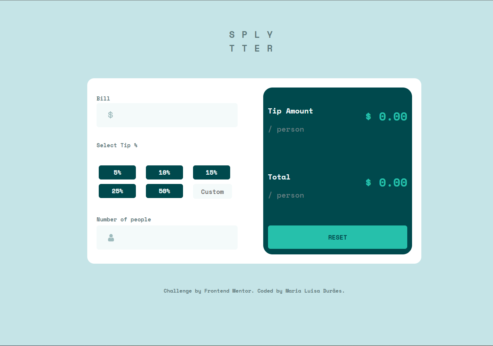

# Frontend Mentor - Tip calculator

Essa é a minha solução para o [Tip calculator app challenge do Frontend Mentor](https://www.frontendmentor.io/challenges/tip-calculator-app-ugJNGbJUX).

# Sobre o desafio

Os usuários devem ser capazes de:

- Visualizar o layout ideal para o aplicativo, dependendo do tamanho da tela do dispositivo

- Visualizar os estados de todos os elementos interativos na página

- Calcular a gorjeta correta e o custo total da conta por pessoa

### O que foi utilizado nesse desafio:

- HTML
- CSS
- JavaScript
- SASS

# Minha solução

Link: https://marialuisamd.github.io/TIP_CALCULATOR